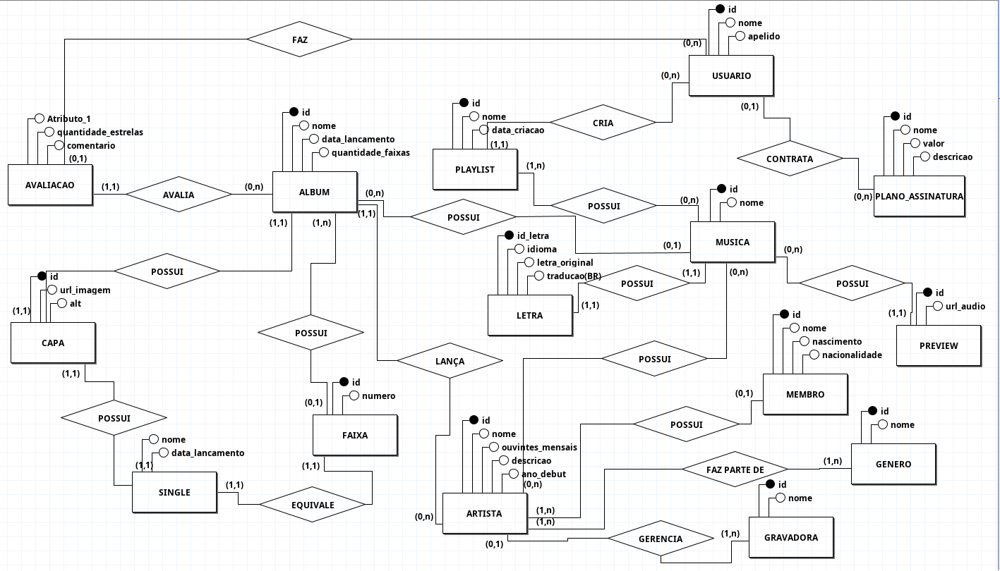
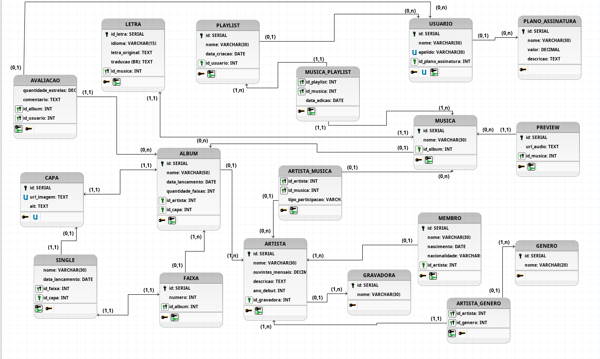

# 🎵 Banco de Dados de Streaming Musical
---

Trabalho final da disciplina de **Banco de Dados**, modelando um sistema de streaming musical do zero — do MER ao SQL, passando por entidades, relacionamentos, restrições e consultas.
---

## 🗂️ Passo-a-passo do projeto

```
📦 
 ├── 📐 Passo 1  — Identificação das Entidades (fortes, fracas e associativas)
 ├── 🗺️  Passo 2  — MER + DER
 ├── 🏗️  Passo 3  — DDL: CREATE TABLE e ALTER TABLE em PostgreSQL
 ├── 🔒 Passo 4  — Restrições: CHECK, DEFAULT, UNIQUE
 ├── 💥 Passo 5  — DML de violações
 ├── 📥 Passo 6  — INSERTs com dados reais de artistas e músicas
 └── 🔍 Passo 7 — Consultas SQL: JOINs, GROUP BY, UNION, INTERSECT, EXCEPT
```

---

## 🧱 Entidades do Sistema

### Fortes (as que existem por conta própria)
| Entidade | O que representa |
|---|---|
| `ARTISTA` | Lord Huron, Taylor Swift, Charli XCX... |
| `ALBUM` | Strange Trails, GUTS, OK Computer... |
| `MUSICA` | As faixas que a gente ouve |
| `CAPA` | A arte visual |
| `GENERO` | Indie Folk, Hyperpop, R&B... |
| `USUARIO` | Você, eu |
| `PLANO_ASSINATURA` | Free, Premium, etc |
| `PLAYLIST` | Sad Hours, Workout Mix, Favoritas |
| `GRAVADORA` | Republic Records, Parlophone... |

### Fracas (precisam de uma entidade forte pra existir)
`LETRA` · `AVALIACAO` · `SINGLE` · `FAIXA` · `PREVIEW` · `MEMBRO`

### Tabelas Associativas (o N:M da nossa vida)
`MUSICA_PLAYLIST` · `ARTISTA_GENERO` · `ARTISTA_MUSICA`

---

## 🗺️ MER - Modelo Entidade-Relacionamento


## 🗺️ DER - Diagrama Entidade-Relacionamento


## 🐍 Interface em Python


## 🔒 Restrições Implementadas

```sql
-- Artista não pode ter ouvintes negativos 
ouvintes_mensais DECIMAL CHECK (ouvintes_mensais >= 0)

-- Playlist já nasce com a data de hoje
data_criacao DATE DEFAULT CURRENT_DATE

-- Estrelas só em meios: 0, 0.5, 1, 1.5 ... 5
quantidade_estrelas DECIMAL CHECK (quantidade_estrelas IN (0, 0.5, 1, 1.5, 2, 2.5, 3, 3.5, 4, 4.5, 5))

-- Dois usuários não podem ter o mesmo apelido
apelido VARCHAR(30) UNIQUE
```

---

## 💥 Violando Restrições

Porque às vezes o aprendizado vem do erro:

```sql
-- Artista com -100 ouvintes? O banco não deixa.
INSERT INTO ARTISTA (ouvintes_mensais) VALUES (-100);

-- Nota 3.7? Não existe meio ponto em 3.7. Rejeitado.
INSERT INTO AVALIACAO (quantidade_estrelas) VALUES (3.7);

-- Dois usuários com o mesmo apelido? O UNIQUE diz não.
INSERT INTO USUARIO (nome, apelido) VALUES ('Rafael Rocha', 'rara123');
INSERT INTO USUARIO (nome, apelido) VALUES ('Raulivan Rodrigo', 'rara123'); -- 💣
```

> ℹ️ O `DEFAULT` não pode ser "violado" — ele apenas preenche o que você não preencheu.

---

## 🎤 Artistas Cadastrados

Uma seleção cuidadosamente preenchida de acordo com os gostos musicais dos meus amigos (e um dedo meu pra salvar essa enxurrada)

- 🤠 Lord Huron · 🎸 Radiohead · 🌈 Olivia Rodrigo
- 💫 Taylor Swift · 🌙 Conan Gray · 🏳️‍⚧️ Urias
- 🦋 Charli XCX · 🌊 Harry Styles · 🎻 Billie Eilish
- 🌿 Nothing But Thieves · 🎺 Wild Youth · e mais...

---

## 🔍 Consultas SQL

| # | Tipo | O que faz |
|---|---|---|
| 7 | `INNER JOIN` | Músicas com álbum e artista |
| 8 | `LEFT JOIN` | Músicas com (ou sem) preview |
| 9 | `RIGHT JOIN` | Playlists com (ou sem) músicas |
| 10 | `FULL JOIN` | Artistas e membros, sem deixar ninguém de fora |
| 11 | `GROUP BY` + `HAVING` | Artistas com mais de um álbum |
| 12 | `UNION` | Busca unificada de artistas e usuários |
| 13 | `INTERSECT` | Usuários que criaram playlist E avaliaram |
| 14 | `EXCEPT` | Músicas que nunca foram adicionadas a playlists 😔 |

---

## 🛠️ Tecnologia

- **SGBD:** PostgreSQL
- **Paradigma:** Relacional

---

## 👥 Equipe

- Eu: desenvolvimento, modelagem, DDL, DML, consultas, restrições, diagramas, dados, tudo.
- Amigos: sugestões de músicas, artistas, álbuns; palpites errados.

